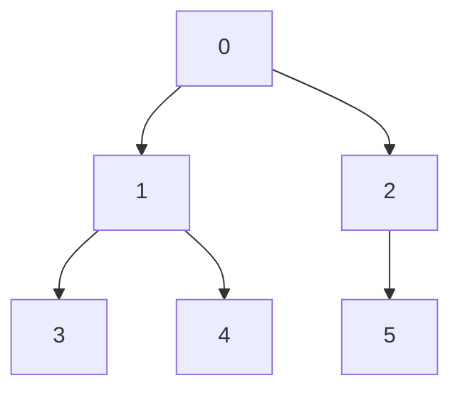

# 排序算法

## 速查表

|   类型   |   最差时间    | 平均时间 | 空间 | 稳定性 |     其它     |
| :------: | :-----------: | :------: | :--: | :----: | :----------: |
| 插入排序 |      n^2      |          |  1   |   Y    |              |
| 快速排序 |      n^2      |   nlgn   |  1   |   N    |              |
| 希尔排序 |      n^2      |          |  1   |   N    |              |
| 选择排序 |      n^2      |          |  1   |   N    |              |
| 冒泡排序 |      n^2      |          |  1   |   Y    |              |
| 归并排序 |     nlgn      |          |  n   |   Y    |              |
|  堆排序  |     nlgn      |          |  1   |   N    |              |
| 计数排序 |   O\(k+n\)    |          |      |        |              |
| 基数排序 | O\(d\(k+n\)\) |          |      |        |              |
|  桶排序  |      n^2      |    n     |  n   |   Y    | 快，很耗空间 |

## 选择排序：不稳定，时间复杂度 O\(n^2\)

思想：每次迭代，**选择**最值的元素，把它放到头部

## 插入排序：稳定，时间复杂度 O\(n^2\)

思想：每次迭代，把下一个未排序的元素，**插入**到已排好的序列中。

（选择插入位置时，可以用二分查找优化时间，但可能导致排序结果非稳定）

## 冒泡排序：稳定，时间复杂度 O\(n^2\)

思想：每次迭代，顺序交换所有相邻元素，直到最值元素完成排位。

## 堆排序：不稳定，时间复杂度 O\(nlog n\)



- 将序列看成完全二叉树的线性存储结构。
  - leftChild = current \* 2 + 1
  - rightChild = current \* 2 + 2
- 迭代
  - heapfy, 将最值挪到顶部
  - 取顶部最值，交换到右下角，这样最值的最终位置就确定了。
  - 序列长度减 1，重复以上过程

```java
//构建大根堆：将array看成完全二叉树的顺序存储结构
private int[] buildMaxHeap(int[] array){
    //从最后一个节点array.length-1的父节点（array.length-1-1）/2开始，直到根节点0，反复调整堆
    for(int i=(array.length-2)/2;i>=0;i--){
        adjustDownToUp(array, i,array.length);
    }
    return array;
}

//将元素array[k]自下往上逐步调整树形结构
private void adjustDownToUp(int[] array,int k,int length){
    int temp = array[k];
    for(int i=2*k+1; i<length-1; i=2*i+1){    //i为初始化为节点k的左孩子，沿节点较大的子节点向下调整
        if(i<length && array[i]<array[i+1]){  //取节点较大的子节点的下标
            i++;   //如果节点的右孩子>左孩子，则取右孩子节点的下标
        }
        if(temp>=array[i]){  //根节点 >=左右子女中关键字较大者，调整结束
            break;
        }else{   //根节点 <左右子女中关键字较大者
            array[k] = array[i];  //将左右子结点中较大值array[i]调整到双亲节点上
            k = i; //【关键】修改k值，以便继续向下调整
        }
    }
    array[k] = temp;  //被调整的结点的值放人最终位置
}

//堆排序
public int[] heapSort(int[] array){
    array = buildMaxHeap(array); //初始建堆，array[0]为第一趟值最大的元素
    for(int i=array.length-1;i>1;i--){
        int temp = array[0];  //将堆顶元素和堆低元素交换，即得到当前最大元素正确的排序位置
        array[0] = array[i];
        array[i] = temp;
        adjustDownToUp(array, 0,i);  //整理，将剩余的元素整理成堆
    }
    return array;
}

//删除堆顶元素操作
public int[] deleteMax(int[] array){
    //将堆的最后一个元素与堆顶元素交换，堆底元素值设为-99999
    array[0] = array[array.length-1];
    array[array.length-1] = -99999;
    //对此时的根节点进行向下调整
    adjustDownToUp(array, 0, array.length);
    return array;
}
```

## 归并排序：稳定，时间复杂度 O\(nlog n\)

- 递归，直到字序列为单元素或空集
- 每次递归将两个子集合并
  - 合并过程就是从两个子序列的头部取各自的最值

## 快速排序：不稳定，时间复杂度 最理想 O\(nlogn\) 最差时间 O\(n^2\)

- 分治
- 从序列头选取一个元素（随机或者）
- 将选取的元素移动到合适的位置，使得左边都比它小，右边都比它大（该元素的最终位置被确定）
- 递归处理左侧和右侧的子序列，直到子序列只剩下一个元素位置。

## 希尔排序（Shell Sort ）：不稳定，时间复杂度 平均时间 O\(nlogn\) 最差时间 O\(n^s\) 1&lt;s&lt;2

- 它是分组版本的插入排序，减少数字的移动，从而提高性能。
- 一开始分 n/2 组，再来分 n/4 组，直到分 1 组（n 是成员总数）
- 每次组内插入排序即可

## 桶排序

1. 按值域创建很多桶
2. 按数值，把元素放进桶里
3. 最后把桶中的元素依次取出

- 适合对值域窄的元素进行排序（比如人的年龄）
